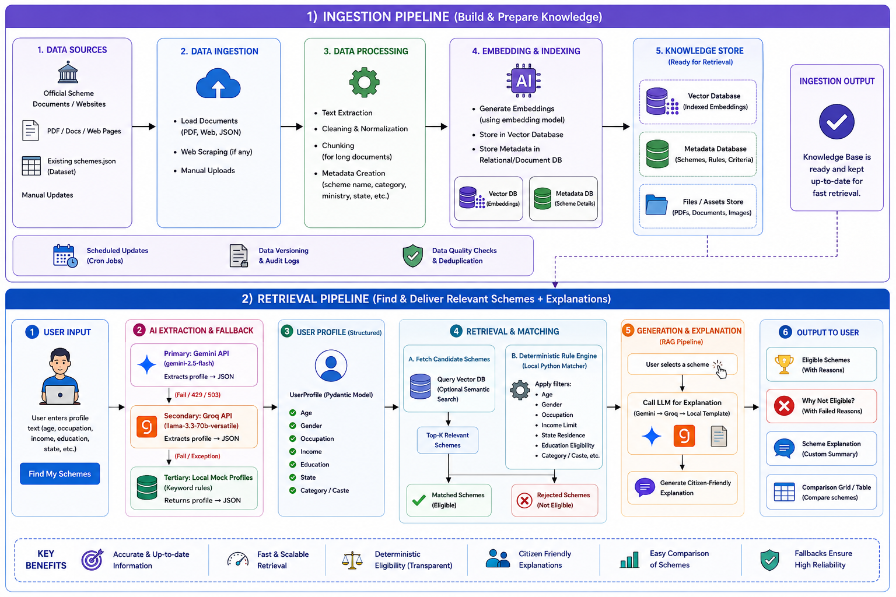

# AI Youth & Employment Scheme Navigator

An intelligent, high-performance web companion that matches Indian citizens to youth development, internship, scholarship, and employment schemes. 

Built using **Streamlit**, the application uses a hybrid architecture combining structured Large Language Model (LLM) extraction with a deterministic local rule matching engine.

---

## 1. Application Flow & Architecture

Below is the technical flow of the application. The system implements a **three-tier LLM fallback cascade** for candidate profile extraction and a **secondary RAG cascade** for generating citizen-friendly explanations.

### Selected Architecture Diagram (Diagram 2)
This diagram represents the actual production implementation:


---

### Architecture Diagram Comparison

We evaluated two potential architecture models during the design phase:

| Feature / Metric | Diagram 1: Ingestion & Vector DB (Proposed) | Diagram 2: Three-Tier Cascade & Local Matcher (Actual Production) |
| :--- | :--- | :--- |
| **Architecture Diagram** |  |  |
| **Profile Extraction** | Uses Gemini 2.5 Flash. | **Three-Tier Cascade**: Gemini 2.5 Flash (Primary) $\rightarrow$ Groq Llama 3.3 (Secondary Fallback) $\rightarrow$ Local Mock Profiles (Tertiary offline fallback). |
| **Database Retrieval** | Automated scraper crons, chunks documents, embeds them, and runs semantic search on a Vector Database. | Direct loading of the structured JSON database [schemes.json](schemes.json) directly in memory. |
| **Eligibility Matching** | Hybrid semantic query retrieval + local post-filters. | **100% deterministic local rule-matching engine** checking user profile traits (age, gender, state, income, education, occupation) against scheme conditions in Python. |
| **Secondary RAG Explainer** | Vector RAG lookup. | Dynamic generation fallback (Gemini $\rightarrow$ Groq $\rightarrow$ Offline text templates) for citizen-friendly explanations and scheme comparison grids. |
| **Project Codebase Match** | ❌ **Incorrect**: The application does not use web scrapers, cron jobs, embedding models, or vector databases. |  **100% Match**: Exactly matches the flow, fallback routes, and class definitions implemented in [app.py](app.py). |

### Why Diagram 2 Fits Best
1. **Technical Accuracy**: The project does not implement an ingestion pipeline, web scraping, data chunking, embeddings, or a vector database. Matching is performed entirely locally against `schemes.json` using standard Python logic.
2. **Resilience & Fallback Representation**: It correctly details the cascading fallback mechanism (Gemini $\rightarrow$ Groq $\rightarrow$ Offline templates) used both for profile parsing and explanation/comparison generation, which is a major design pattern in our implementation.
3. **Reflects Actual User Experience**: It shows the true end-to-end interactive flow of the Streamlit application.

---

## 2. Features
* 🔒 **Privacy-First**: No personal data is stored; matching is calculated entirely in-memory.
* ⚡ **High Reliability**: If the default Gemini API key encounters rate limits (`429 Resource Exhausted`) or server outages (`503 Unavailable`), the system automatically switches to the **Groq API** or offline fallback templates.
* 📋 **Matched Analysis**: Provides scores and direct links to active portals (e.g. Skill India Digital).
* ❌ **Transparent Rejections**: Lists exactly why a user did not qualify for a scheme (e.g. income limit exceeded or age out of boundaries).

---

## 3. Quick Start

### Prerequisites
* Python 3.10 or higher installed.
* A terminal setup with Git.

### Setup & Run
1. **Clone the repository**:
   ```bash
   git clone https://github.com/akash121bera-svg/Sudipto-Hackathon.git
   cd Sudipto-Hackathon
   ```

2. **Activate the Virtual Environment**:
   * **PowerShell**:
     ```powershell
     & .venv/Scripts/Activate.ps1
     ```
   * **Command Prompt**:
     ```cmd
     .venv\Scripts\activate.bat
     ```
   * **Git Bash / Linux / macOS**:
     ```bash
     source .venv/Scripts/activate
     ```

3. **Configure Environment Variables**:
   Create a `.env` file in the root folder with your keys:
   ```env
   GEMINI_API_KEY=your_gemini_api_key
   GROQ_API_KEY=your_groq_gsk_api_key
   ```

4. **Install Dependencies**:
   ```bash
   pip install -r requirements.txt
   ```

5. **Launch the Web App**:
   ```bash
   streamlit run app.py
   ```

---

## 4. Testing Suite

The repository contains a testing suite inside the `testing/` directory:
* **[testing/queries.json](testing/queries.json)**: A JSON collection of 15 candidate profiles covering target matches and strict edge cases (underage checks, overage checks, invalid occupation checks).
* **[testing/test_queries.pdf](testing/test_queries.pdf)**: A professionally compiled PDF listing all test queries and expected matches.
* **[testing/README.md](testing/README.md)**: A user guide explaining how to execute and assert the test cases.
