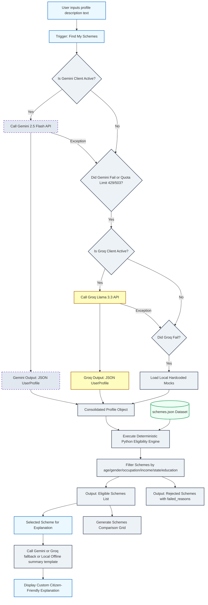

# Application Architecture & Flow Diagram Spec

This document describes the architectural pipeline of the **AI Youth & Employment Scheme Navigator**. 

You can paste the **Mermaid.js code block** or the **diagram prompt** below directly into ChatGPT (or any Mermaid renderer like [mermaid.live](https://mermaid.live)) to generate a clean visual flowchart of the application's lifecycle.

---

## 1. Mermaid.js Flowchart Code
*Paste this code block directly into ChatGPT or a Mermaid editor to render the graphical flow:*



---

## 2. ChatGPT Prompt for Graphical Diagram Generation
*If you want ChatGPT to draw an image or generate a structured visual architecture drawing, copy and paste the text below:*

```text
Please generate a polished, professional graphical block diagram for this Python-Streamlit AI application architecture. Use the following specifications:

1. User Input Layer:
   - Plain text input describing candidate age, occupation, income, caste, state, and education.

2. AI Extraction & Fallback Cascade Layer:
   - Primary: Gemini API (gemini-2.5-flash) with structured JSON response schema (UserProfile Pydantic model).
   - Secondary Fallback: Groq API (llama-3.3-70b-versatile) compatible chat completion.
   - Tertiary Fallback: Local deterministic keyword-based mock profiles.
   - Error Handling: Errors are captured silently, logged to console, and clean notices are displayed in Streamlit.

3. Rule-Based Eligibility Engine (Local Python Matcher):
   - Loads local 'schemes.json' dataset.
   - Deterministic matching functions compare UserProfile properties against scheme constraints (Age ranges, gender filters, education ranks, state residence, and parent income limits).

4. UI Output Presentation Layer:
   - Match Results: Displays "Eligible Schemes" list and reasons for match.
   - Rejections: Displays "Why Not Eligible?" with detailed failure causes.
   - Dynamic RAG Summary: Feeds chosen scheme details to LLM (Gemini -> Groq -> Local Template) to build a custom "citizen-friendly explanation."
   - Comparison Grid: Generates comparison table using LLM or local Markdown formatter.

Please render this flowchart visually or provide a clear structural diagram illustrating this pipeline.
```
