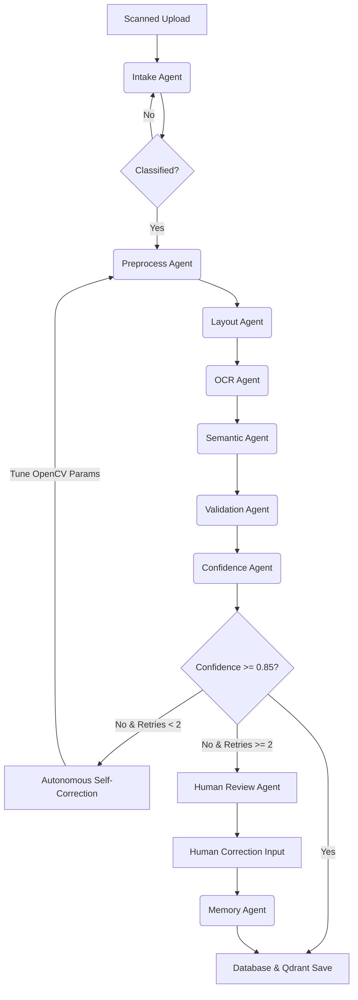

# Autonomous Multi-Agent Document Intelligence Platform

An enterprise-grade, hackathon-ready Autonomous Multi-Agent Document Intelligence Platform built with **FastAPI**, **LangGraph**, **PostgreSQL**, **Qdrant**, and **React**. 

This system acts as a document intelligence operating system that transforms raw scanned or handwritten physical application forms into high-accuracy structured digital forms using cooperative multi-agent reasoning, visual preprocessing, hybrid OCR (Tesseract + TrOCR), validation checking, self-correcting retries, and a human-in-the-loop learning feedback loop.

---

## 🏛️ System Architecture

The platform follows a **Supervisor Agent** pattern where a central orchestrator directs global state, evaluates OCR confidence and logical validation failures, triggers adaptive preprocessing retries, escalates low-confidence cases to humans, and updates long-term learning memory.



---

## 🤖 The Nine Autonomous Agents

1. **Supervisor Agent (`supervisor.py`)**: Central router managing the state machine, routing, and recording step-by-step reasoning traces.
2. **Intake Agent (`intake.py`)**: Validates file formats (JPEG, PNG, etc.), file sizes, and enforces initial constraints.
3. **Vision Preprocessing Agent (`preprocess.py`)**: Dynamically applies OpenCV operations: deskewing (minAreaRect contour angles), denoising, CLAHE contrast adjustments, and adaptive Gaussian thresholding.
4. **Layout Intelligence Agent (`layout.py`)**: Integrates template schema matching with Qdrant and OpenCV contour detection to segment checkboxes and text fields.
5. **OCR Agent (`ocr.py`)**: Employs a hybrid OCR strategy, running Tesseract for printed text and Hugging Face `microsoft/trocr-base-handwritten` for handwritten text regions.
6. **Semantic Agent (`semantic.py`)**: Uses Llama3 (via Ollama) or rule-based regex parsers to format, normalize, and match raw text values to canonical schemas.
7. **Validation & Reasoning Agent (`validation.py`)**: Enforces logical consistency (such as age consistency vs Date of Birth, email formatting, and mandatory inputs).
8. **Confidence Agent (`confidence.py`)**: Assigns confidence levels to fields, penalizes fields failing validation checks, and calculates trust indexes.
9. **Human Review Agent (`human_review.py`)**: Pauses graph execution for low-confidence documents and handles ticket queues for human operator input.
10. **Memory Agent (`memory.py`)**: Commits human corrections to PostgreSQL and vectorizes correction mappings in Qdrant (long-term semantic retrieval), facilitating auto-correction on future extraction runs.

---

## 📂 Folder Structure

```
magical-fermi/
├── backend/
│   ├── app/
│   │   ├── core/           # Config, database, Qdrant client
│   │   ├── agents/         # LangGraph state, supervisor router, sub-agent nodes
│   │   ├── models/         # SQLAlchemy schemas & Pydantic models
│   │   ├── routes/         # Document, review, and memory API routes
│   │   └── main.py         # Entrypoint, mounts, startup handlers
│   ├── static/
│   │   └── index.html      # Glassmorphism React/Babel Frontend Dashboard
│   ├── requirements.txt    # Python backend dependencies
│   └── Dockerfile          # Backend build config
├── docker-compose.yml      # Multi-container service orchestrator
├── verify_ocr.py           # Self-contained dynamic verification script
├── setup_demo.bat          # Windows local environment setup script
└── README.md
```

---

## 🚀 Getting Started

### Method 1: Local Installation (Fastest for Windows)

Simply double-click the **`setup_demo.bat`** file or run:
```bash
# Set up venv, install packages, and verify OCR logic
setup_demo.bat
```

To run the local server manually:
```bash
# Activate virtual environment
call venv\Scripts\activate

# Launch FastAPI backend with reloading
uvicorn backend.app.main:app --reload
```
Open **`http://localhost:8000`** in your browser to view the interactive UI.

---

### Method 2: Docker Containers (Production Ready)

To boot up the complete Postgres, Qdrant, Ollama, and FastAPI stack in Docker:
```bash
# Run docker compose from the root directory
docker compose up --build -d
```
FastAPI backend and UI dashboard will serve at **`http://localhost:8000`**.

---

## 🧪 OCR Verification Run

The system includes a verification script (`verify_ocr.py`) which:
1. Dynamically draws a sample form image (`sample_form.png`) using OpenCV, writing labels and simulated dark-blue ink handwriting rotated at a skew of **-2 degrees**.
2. Runs the image cleanup (automatically deskewing it back to **0 degrees**).
3. Performs layout intelligence and crops fields.
4. Triggers Tesseract and TrOCR fallback text extraction, printing a clean validation output table.
